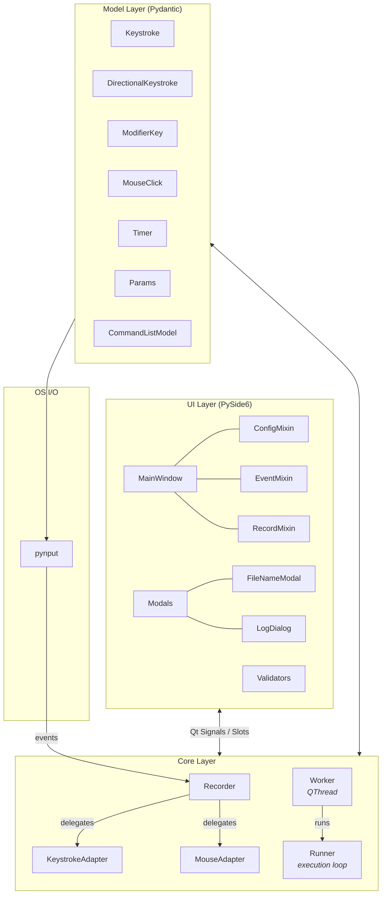
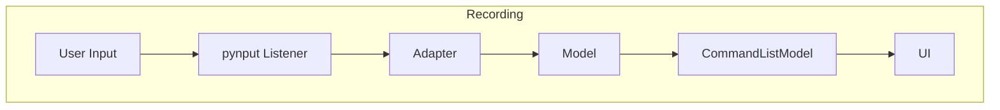
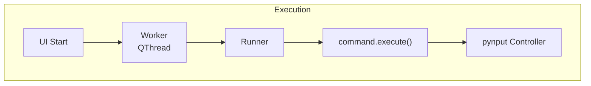

# NW Bot

[](https://coveralls.io/github/zelazna/nw_bot)
[](https://github.com/zelazna/nw_bot/actions/workflows/test.yaml)


A desktop automation tool for **New World** or **Neverwinter** built with PySide6 and pynput. Record and replay keyboard/mouse sequences with configurable timing, multi-window support, and drag-and-drop command reordering.

## Demo

[](https://www.youtube.com/watch?v=5BhUPGTgu_A)

## Features

- **Record & Replay** -- Capture keystrokes (with modifiers) and mouse clicks, then replay them with precise timing
- **Randomized Intervals** -- Set an interval range (e.g. `1-3` seconds) for natural-looking delays between actions
- **Multi-Window** -- Cycle through multiple game windows automatically via Alt+Tab
- **Timed Execution** -- Run the bot for a configurable duration
- **Drag & Drop Reordering** -- Rearrange recorded commands visually
- **Save / Load Configs** -- Persist action sequences to JSON files and reload them later
- **Filterable Log Viewer** -- Color-coded, real-time log output

## Architecture



### Data Flow



The `Recorder` starts OS-level listeners. `KeystrokeAdapter` and `MouseAdapter` convert raw events into Pydantic models that are appended to the `CommandListModel` (a Qt list model). The UI refreshes automatically via Qt signals.



A `Worker` thread iterates through the command list. Each model's `execute()` method drives the pynput keyboard/mouse controllers. Random intervals are picked from the configured range. If multi-window is enabled, `Runner` Alt+Tabs between windows each cycle.

### Project Structure

```
bot/
├── core/               # Bot engine
│   ├── constants.py        # App metadata, virtual key codes
│   ├── control.py          # Runner -- main execution loop
│   ├── keystroke_adapter.py# Qt & pynput keystroke adapters
│   ├── mouse_adapter.py    # Mouse click adapter
│   ├── recorder.py         # Recording coordinator
│   └── worker.py           # QThread worker + signals
├── models/             # Pydantic data models
│   ├── keyboard.py         # Keystroke, DirectionalKeystroke, ModifierKey
│   ├── mouse.py            # MouseClick, Button enum
│   ├── command_list.py     # Qt list model (drag & drop)
│   ├── params.py           # Execution parameters
│   └── timer.py            # Hold-duration model
├── ui/                 # GUI
│   ├── mixins/             # ConfigMixin, EventMixin, RecordMixin
│   ├── main_window.py      # Main window
│   ├── main_window.ui      # Qt Designer file
│   ├── modals.py           # Dialogs
│   └── validators.py       # Input validators
├── utils/              # Helpers
│   ├── config.py           # JSON load / save
│   ├── format_time.py      # ms → HH:MM:SS
│   ├── logger.py           # Qt log handler
│   └── settings_manager.py # Recent files, save folder
└── main.py             # Entry point
```

### Key Design Patterns

| Pattern | Where | Purpose |
|---------|-------|---------|
| **Command** | `keyboard.py`, `mouse.py`, `timer.py` | Each action is an object with an `execute()` method |
| **Adapter** | `keystroke_adapter.py` | Abstracts Qt vs pynput input sources behind a common interface |
| **Observer** | Qt signals / slots | Decouples UI updates from core logic |
| **Mixin** | `ui/mixins/` | Splits MainWindow responsibilities into composable concerns |

## Get the Latest Release

<https://github.com/zelazna/nw_bot/releases/latest>

## Install

```bash
pip install .
```

Or using uv (recommended):

```bash
uv sync
```

## Launch It

Using the installed command:
```bash
bot-gui
```

Or directly with uv:
```bash
uv run python bot/main.py
```

Or using Make:
```bash
make run
```

## Quick Start with Makefile

```bash
make help      # Show all available commands
make run       # Run the application
make test      # Run tests with coverage
make ui        # Compile Qt Designer .ui files to Python
make install   # Install dependencies
make dev       # Install dev dependencies (including test tools)
make clean     # Clean build artifacts
```

## Generate the UI Python File

```bash
pyside6-uic bot/ui/main_window.ui -o bot/ui/main_window_ui.py
```

Or using Make:
```bash
make ui
```

## Generate the Executable

```bash
pyinstaller nwbot.spec
```

## Run Tests

```bash
python -m pytest --cov=bot --cov-report=term --cov-report=xml
```

Or using Make:
```bash
make test
```

## Tech Stack

| Component | Technology |
|-----------|------------|
| GUI | PySide6 (Qt 6) |
| Input Control | pynput |
| Data Validation | Pydantic v2 |
| Packaging | PyInstaller / Nuitka |
| CI/CD | GitHub Actions |
| Python | 3.12 |

## Troubleshooting

### Linux/Wayland: X11 Authorization Error

If you encounter:

```
ImportError: this platform is not supported: ('failed to acquire X connection: ...
```

This happens because `pynput` requires X11 access and Wayland restricts it by default.

**Solution:**

```bash
xhost +local:
```

To make it permanent:

```bash
echo "xhost +local: >/dev/null 2>&1" >> ~/.bashrc
```

> **Note:** This is safe for local applications but be cautious on multi-user systems.
